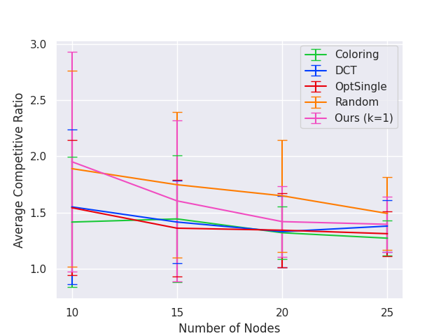
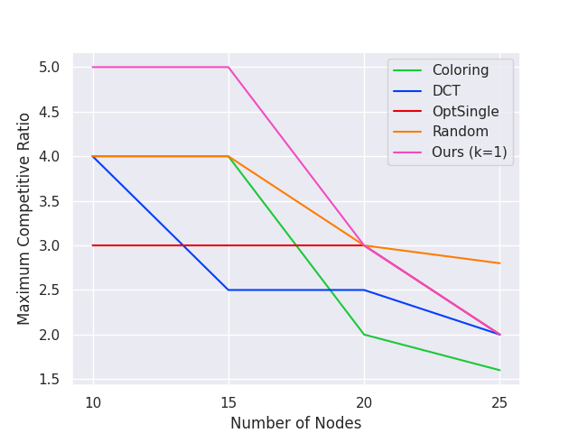
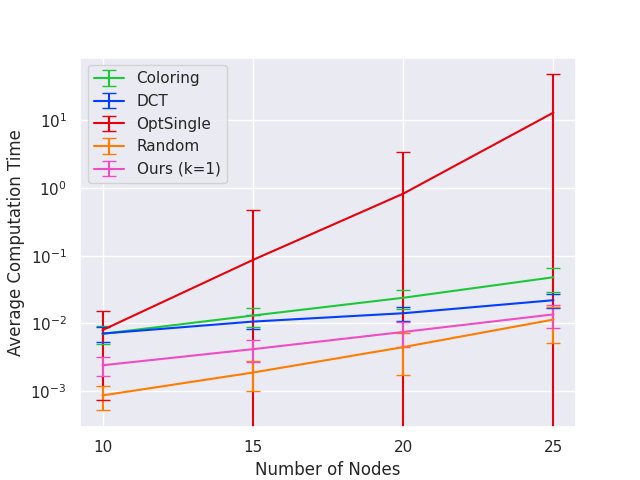
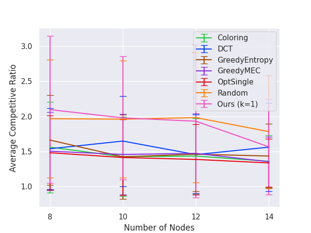
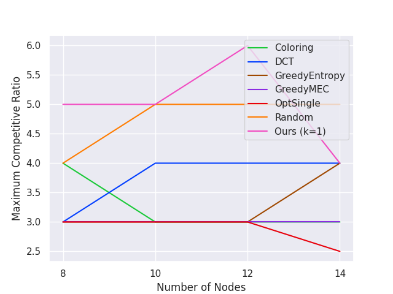
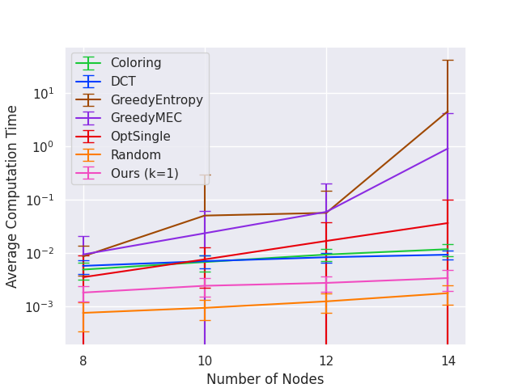
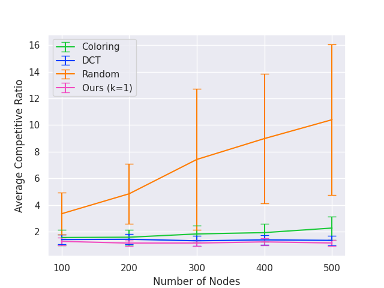
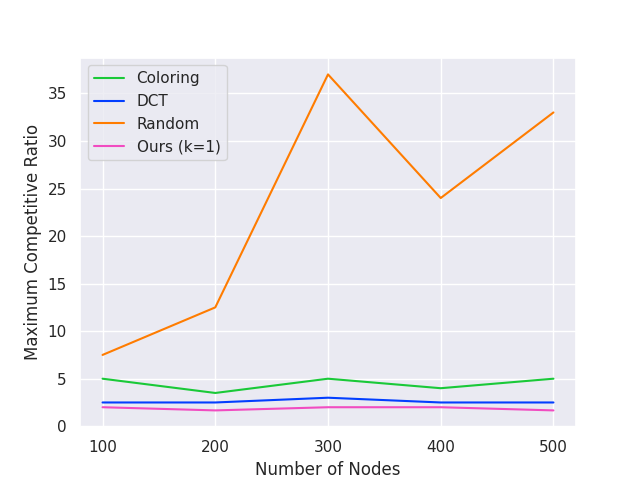
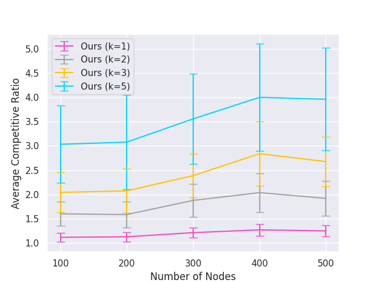

# Verification and search algorithms for causal DAGs

This is the accompanying repository the "Verification and search algorithms for causal DAGs" paper. It is available at https://arxiv.org/abs/2206.15374. Our experiments are based on https://github.com/csquires/dct-policy, the accompanying repository of [SMG+20].

## Experimental details

### Graph classes

The synthetic graphs are random connected DAGs whose essential graph is a single chain component (i.e. moral DAGs in [SMG+20]'s terminology). Below, we reproduce the synthetic graph generation procedure from Section 5 of [SMG+20].

1. Erdős-Rényi styled graphs  
These graphs are parameterized by 2 parameters: `n` and `density` $\rho$. Generate a random ordering $\sigma$ over `n` vertices. Then, set the in-degree of the nth vertex (i.e. last vertex in the ordering) in the order to be $X_n = \max${1, $\texttt{Binomial}$(`n`-1, $\rho$)}, and sample $X_n$ parents uniformly form the nodes earlier in the ordering. Finally, chordalize the graph by running the elimination algorithm of [KF09] with elimination ordering equal to the reverse of $\sigma$.

2. Tree-like graphs  
These graphs are parameterized by 4 parameters: `n`, `degree`, `e_min`, and `e_max`. First, generate a complete directed `degree`-ary tree on `n` nodes. Then, add $\texttt{Uniform}$(`e_min`, `e_max`) edges to the tree. Finally, compute a topological order of the graph by DFS and triangulate the graph using that order.

### Algorithms benchmarked

- `random`: A baseline algorithm that repeatedly picks a random non-dominated node (a node that is incident to some unoriented edge) from the interventional essential graph
- `dct`: `DCT Policy` of [SMG+20]
- `coloring`: `Coloring` of [SKD+15]
- `opt_single`: `OptSingle` of [HB14]
- `greedy_minmax`: `MinmaxMEC` of [HG08]
- `greedy_entropy`: `MinmaxEntropy` of [HG08]
- `separator`: Our `Algorithm 1`. It takes in a parameter $k$ to serve as an upper bound on the number of vertices to use in an intervention.

All the above algorithms perform **atomic interventions**. Our algorithm `separator` perform atomic interventions when given $k=1$ and **bounded size interventions** when given $k > 1$.

### Experiments

1. Experiment 1 (`exp1.py`):  
Graph class 1 with `n` $\in$ {10, 15, 20, 25} and `density` $\rho = 0.1$. This is the same setup as `dct-policy`'s `fig1a.py`. Additionally, we run `separator` with $k = 1$. 

2. Experiment 2 (`exp2.py`):  
Graph class 1 with `n` $\in$ {8, 10, 12, 14} and `density` $\rho = 0.1$. This is the same setup as `dct-policy`'s `fig1b.py`. Additionally, we run `separator` with $k = 1$. Note that this is the same graph class as `exp1.py` but on smaller graphs because some slower algorithms are being run. 

3. Experiment 3 (`exp3.py`):  
Graph class 2 with `n` $\in$ {100, 200, 300, 400, 500} and (`degree`, `e_min`, `e_max`) = (4, 2, 5). This is the same setup as `dct-policy`'s `fig1c.py`. Additionally, we run `separator` with $k = 1$.

4. Experiment 4 (`exp4.py`):  
Graph class 1 with `n` $\in$ {10, 15, 20, ... , 95, 100} and `density` $\rho = 0.1$. We run `separator` with $k \in$ {1,2,3,5} on the same graph class as `exp1.py`, but on larger graphs. 

5. Experiment 5 (`exp5.py`):  
Graph class 2 with `n` $\in$ {100, 200, 300, 400, 500} and (`degree`, `e_min`, `e_max`) = (40, 20, 50). We run `separator` with $k \in$ {1,2,3,5} on the same graph class as `exp3.py`, but on denser graphs. 

## Instructions on reproducing our experiments

To reproduce our figures in the appendix, execute `bash script.sh` after cloning. The script does the following:
1) Download necessary files
2) Modify the `dct-policy` codebase appropriately for our experiments
3) Run the experiments
4) Generate the plots and place in a folder called `figures`

We also included a copy of the produced `figures` sub-directory in here so you may look at the output without running the script. We have also renamed plot names to reflect the experiments appropriately.

## High-level description of files in `our_code` folder

The following files are modifications of the dct-policy source files:
1) `alg_runner.py`
2) `config.py`
3) `dag_loader.py`
4) `pdag.py`
5) `plot_results_vary_nnodes.py`
6) `result_getter.py`

We only slightly modified the above files to incorporate our algorithms. For instance, we have to import our scripts and add some new dictionary entries so that the experiment scripts will also run our algorithms and the insert the results in the same plots. `pdag.py` includes a one-line bug fix (to correctly handle non-atomic interventions) to the `PDAG` class of `causaldag` package.

The following files are newly created by us:
1) `exp1.py`, `exp2.py`, `exp3.py`, `exp4.py`, `exp5.py`
2) `separator_policy.py`
3) `verify.py`

`verify.py` contains our verification algorithm which computes a minimum vertex cover on the covered edges of a given DAG. `separator_policy.py` is our implementation of `Algorithm 1` in the paper that is based on chordal graph separators.

## Implementations of `separator`

Our implementation of the chordal graph separator is the `FAST CHORDAL SEPARATOR` algorithm in [GRE84] which first computes a perfect elimination ordering of a given chordal graph. To do so, we use Eppstein's LexBFS implementation (https://www.ics.uci.edu/~eppstein/PADS/LexBFS.py).

## Interpretation of plots in the `figures` folder

Each experiment produces 3 plots measuring "average competitive ratio", "maximum competitive ratio" and "time taken". For any fixed setting, 100 synthetic DAGs are generated as G\* for testing, so we include error bars for "average competitive ratio" and "time taken" in the plots.

- **Competitive ratio** for an input DAG G\* is measured in terms of *total atomic interventions used to orient the essential graph of G\* to become G\**, divided by *minimum number of interventions needed to orient G\** (i.e. the verification number of G\*).

For non-atomic interventions, the numerator in the competitive ratio computation sums over the number of vertices intervened in total. For example, if our non-atomic intervention is { $v_1$, $v_5$, $v_6$ }, then we add 3 to the numerator in the competitive ratio computation. From our experiments, the **number of interventions** decreases when we allow non-atomic interventions but the **total number of intervened vertices** increases, presenting an interesting trade-off between time and cost -- if an intervention represents a one-day experiments, then we can fully recover G* using bounded interventions in less days but the total cost for all these experiments may be higher.

- **Time** is measured as the total amount of time taken to finish computing the nodes to intervene and performing the interventions. Note that our algorithms can beat `random` in terms of runtime in some cases because `random` uses significantly more interventions and hence more overall computation.

In all plots, "lower is better".

## Plots

### Experiment 1

### Experiment 2

### Experiment 3

### Experiment 4

### Experiment 5

## References

[This paper] Davin Choo, Kirankumar Shiragur, and Arnab Bhattacharyya. Verification and search algorithms for causal DAGs. Advances in Neural Information Processing Systems, 2022. Available at https://arxiv.org/abs/2206.15374

[GRE84] John R. Gilbert, Donald J. Rose, and Anders Edenbrandt. A Separator Theorem for Chordal Graphs. SIAM Journal on Algebraic Discrete Methods, 1984. Available at: https://epubs.siam.org/doi/abs/10.1137/0605032

[HB14] Alain Hauser and Peter Bühlmann. Two Optimal Strategies for Active Learning of Causal Models From Interventional Data. International Journal of Approximate Reasoning, 2014. Available at: https://arxiv.org/pdf/1205.4174.pdf

[HG08] Yang-Bo He and Zhi Geng. Active Learning of Causal Networks with Intervention Experiments and Optimal Designs. Journal of Machine Learning Research, 2008. Available at: https://www.jmlr.org/papers/volume9/he08a/he08a.pdf

[KF09] Daphne Koller and Nir Friedman. Probabilistic graphical models: principles and techniques. MIT press, 2009. Available at: https://mitpress.mit.edu/9780262013192/probabilistic-graphical-models

[SKD+15] Karthikeyan Shanmugam, Murat Kocaoglu, Alexandros G. Dimakis, and Sriram Vishwanath. Learning causal graphs with small interventions. Advances in Neural Information Processing Systems, 2015. Available at: https://arxiv.org/pdf/1511.00041.pdf

[SMG+20] Chandler Squires, Sara Magliacane, Kristjan Greenewald, Dmitriy Katz, Murat Kocaoglu, and Karthikeyan Shanmugam. Active Structure Learning of Causal DAGs via Directed Clique Trees. Advances in Neural Information Processing Systems, 2020. Available at: https://arxiv.org/pdf/2011.00641.pdf
